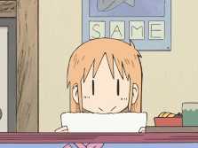

Agents are moving from demos to systems people actually depend on. That shift needs
engineers who care about orchestration, observability, failure modes and evaluation as
much as the model. That's the work I do.

### What that looks like in numbers

- **229-case adversarial suite, 88.6% pass** — 98.7% prompt-injection resistance, 100% jailbreak resistance, on a harness built to break my own agents.
- **91.9% document-QA accuracy at $0.003 a query** — grounded answers with per-query cost tracing, not a demo notebook.
- **130,000+ recipes across 50+ dietary verticals** in production, built with an 8-person engineering and clinical team.

 

### Building

| Project | | |
|---|---|---|
| **[tribev2](https://github.com/Ansumanbhujabal/tribev2)** | `SHIPPING` | NeuroLens — interactive neuroscience analysis on Meta's TRIBE v2 brain-encoding model. PyTorch, CLIP, Whisper, fMRI visualisation. |
| **[Moonsense](https://github.com/Ansumanbhujabal/Moonsense)** | `SHIPPING` | Multi-agent skincare system — medical diagnosis, environment analysis, product matching and safety validation as separate agents. FastAPI, Next.js, Gemini, Langfuse. |
| **[MiroFish](https://github.com/Ansumanbhujabal/MiroFish)** | `EXPLORING` | Swarm engine — thousands of agents with independent personalities forecasting scenarios over GraphRAG. |
| **[agentscope](https://github.com/Ansumanbhujabal/agentscope)** | `EXPLORING` | Alibaba's multi-agent framework. MCP, A2A, and what production orchestration actually requires. |

### Open source contribution

Issues and pull requests filed upstream — mostly orchestration edge cases and failure
modes found while building on these.

### Activity

### Stack

 

Most of what I build starts as a question I can't answer by reading — so I build it,
break it, and measure what survives. Everything above refreshes itself nightly from
the GitHub API; nothing here is a badge service.

If something I've built is useful to you, or wrong, open an issue.

 

<!-- CONTRIBUTIONS:START -->
<!-- CONTRIBUTIONS:END -->
